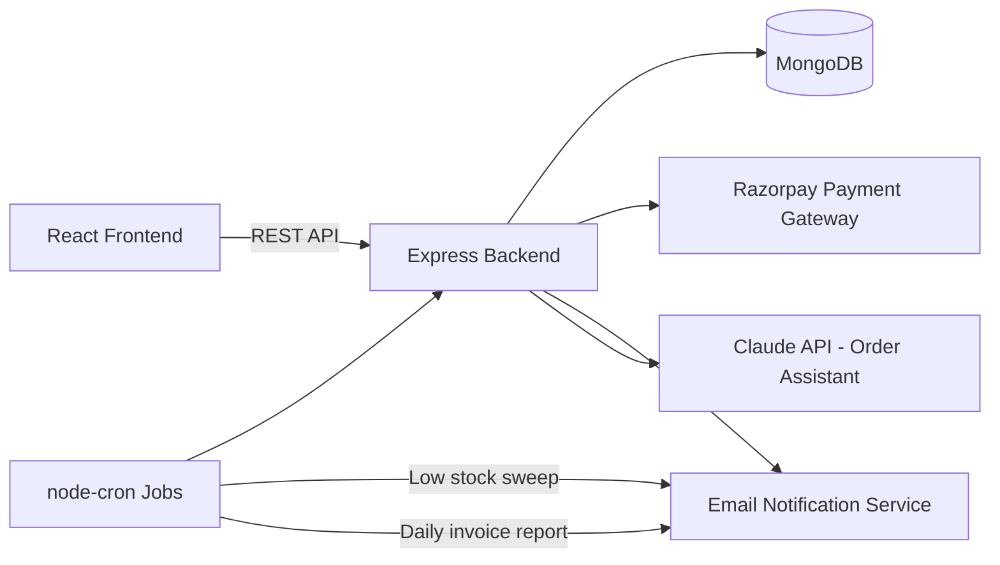

# Smart Vendor & Order Management Platform

A full-stack B2B order management system built to automate the manual, error-prone
order-tracking workflow common among small dealer/distributor networks — replacing
spreadsheet-based order logs with a system that handles orders, payments, low-stock
alerts, and invoicing automatically.

## Business Case

Small dealer/distributor businesses often track orders manually (WhatsApp, phone calls,
spreadsheets), which leads to:
- Delayed order confirmations and stock mismatches
- No automated payment reconciliation
- Manual, end-of-day invoice preparation
- No early warning when inventory runs low

This platform addresses each of these with a single integrated system, taking the
requirement from analysis through to a working, deployable implementation.

## Architecture



## Features

| Area | What it does |
|---|---|
| **Auth** | JWT-based auth with role-based access (admin / vendor / dispatcher) |
| **Inventory** | Product CRUD with real-time stock deduction on order creation |
| **Orders** | Order creation validates stock, computes totals, tracks status through a defined workflow |
| **Payments** | Razorpay integration — order creation, checkout, and HMAC signature verification |
| **Automation** | Scheduled jobs: daily low-stock sweep + end-of-day invoice/report generation (`node-cron`) |
| **AI Assistant** | Natural-language endpoint answering "what's the status of my order?" using the Claude API, with an offline rule-based fallback |
| **Testing** | Jest + Supertest covering auth flow and core order/stock business logic |
| **DevOps** | Dockerized backend, docker-compose (app + MongoDB), GitHub Actions CI (test + build on every push) |

## Tech Stack

- **Backend:** Node.js, Express, MongoDB (Mongoose), JWT, Razorpay SDK, node-cron, Nodemailer
- **Frontend:** React, React Router, Vite
- **Testing:** Jest, Supertest, mongodb-memory-server
- **DevOps:** Docker, Docker Compose, GitHub Actions

## Project Structure

```
vendor-platform/
├── backend/
│   ├── controllers/    # Business logic (auth, orders, products, payments, AI assistant)
│   ├── models/         # Mongoose schemas (User, Product, Order)
│   ├── routes/         # Express route definitions
│   ├── middleware/      # JWT auth + role-based access
│   ├── services/        # Email notification service
│   ├── jobs/             # Scheduled automation jobs (cron)
│   ├── tests/            # Jest test suite
│   └── server.js
├── frontend/
│   └── src/
│       ├── pages/        # Login, Dashboard, Orders, Products
│       ├── components/   # Nav
│       └── api/          # API client
├── docker-compose.yml
└── .github/workflows/ci.yml
```

## Getting Started

### Backend

```bash
cd backend
cp .env.example .env   # fill in MongoDB URI, JWT secret, Razorpay test keys
npm install
npm run dev             # requires a local or Atlas MongoDB instance
```

### Frontend

```bash
cd frontend
npm install
npm run dev              # runs on http://localhost:5173, proxies /api to :5000
```

### Running with Docker

```bash
cp backend/.env.example backend/.env   # fill in real values first
docker compose up --build
```

### Running Tests

```bash
cd backend
npm test
```
> Note: tests use `mongodb-memory-server`, which downloads a MongoDB binary on first
> run — needs internet access the first time.

## API Overview

| Method | Endpoint | Description |
|---|---|---|
| POST | `/api/auth/register` | Register a new user |
| POST | `/api/auth/login` | Login, returns JWT |
| GET | `/api/products` | List products |
| POST | `/api/products` | Create a product |
| POST | `/api/orders` | Create an order (deducts stock) |
| GET | `/api/orders` | List orders |
| POST | `/api/payments/:orderId/initiate` | Create a Razorpay order |
| POST | `/api/payments/verify` | Verify payment signature, mark order paid |
| POST | `/api/assistant/ask` | Ask a natural-language question about your orders |

## What This Project Demonstrates

- Taking a business requirement through analysis, design, and implementation
- Integrating third-party services (payment gateway, email, AI API) into an existing system
- Building automation to reduce manual operational work (stock alerts, invoicing)
- Writing tested, maintainable code with CI/CD for consistent delivery quality
